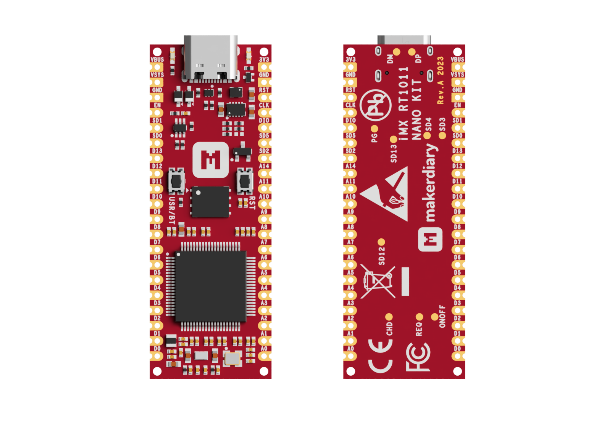

# iMX RT1011 Nano Kit

> High-performance microcontroller board operating up to 500MHz, built around NXP iMX RT1011

## Introduction

[iMX RT1011 Nano Kit][imxrt1011-nanokit] is a small, high-performing prototyping kit designed around NXP's iMX RT1011 Crossover MCU based on the Arm Cortex-M7 core, which operates at speeds up to 500 MHz to provide high CPU performance and best real-time response. It has 128 KB on-chip RAM that can be flexibly configured as TCM or general-purpose as well as numerous peripherals including high speed USB, UART, SPI, I2C, SAI, PWM, GPIO, ADC and etc to support a wide range of applications.

The design provides external 128 Mbit QSPI flash with XIP support, flexible power management, programmable LED and Button, easy-to-use form factor with USB-C and dual-row 40 pins in DIP/SMT type, including up to 33 multi-function GPIO pins (15 can be configured as ADC inputs) and Serial Wire Debug (SWD) port. Available with loose or pre-soldered headers, for even more flexibility in your projects.

It's shipped with [UF2 Bootloader][uf2boot] for easy firmware update. [Zephyr RTOS][zephyr-guide] and [Python][python-guide] are supported as well for rapid prototyping.

## Key Features

* NXP's MIMXRT1011DAE5A Crossover MCU

    - Arm® Cortex-M7 @ 500MHz
    - On-chip RAM size up to 128 KB shared with CM7 TCM
    - Boot ROM (64 KB)
    - High speed USB, UART, SPI, I2C, SAI, PWM, GPIO, ADC support

* 128 Mb QSPI Flash with XIP support and on-the-fly decryption
* User programmable Button and LED
* Up to 33 multi-function General Purpose IOs (15 can be used as ADC inputs)
* Arm Serial Wire Debug (SWD) port via edge pins
* Flexible power management with various options for easily powering the unit
* Wide input voltage range: 1.8 V to 5.5 V, output 3.3V and up to 2A when Input ≥ 2.3 V
* 3.3V IO Operating Voltage
* Dual-row 40 pins 55.88mm x 20.32mm (2.2" x 0.8") DIP/SMT form factor
* Reversible USB-C connector
* Available with loose or pre-soldered headers
* Shipped with UF2 Bootloader supporting Drag-and-drop programming over USB drive
* Easy to enter Boot ROM Serial Downloader even when the UF2 Bootloader gets corrupted
* Built on open source, supporting Zephyr RTOS, Python, etc

## Hardware Diagram

The following figure illustrates the iMX RT1011 Nano Kit hardware diagram. The design is available with loose or pre-soldered pin headers. For more details, refer to the [Hardware description][hardware-description] section.

[][pinout]

## Documentation

We offer an extensive set of documentation, including getting started and developer guides which can help you save big by reducing development effort.

* [iMX RT011 Nano Kit Documentation][wiki]
* [iMX RT011 Nano Kit Product Brief][product-brief]
* [iMX RT1011 Nano Kit Quick Start Guide][quick-start]
* [iMX RT1011 Nano Kit Programming Guide][programming]
* [Develop with Zephyr RTOS][zephyr-guide]
* [Code in Python][python-guide]
* [iMX RT011 Nano Kit Pinout Rev.A][pinout]
* [iMX RT011 Nano Kit Hardware Description][hardware-description]
* [iMX RT011 Nano Kit Schematic Rev.A][schematic]
* [iMX RT011 Nano Kit 3D Model Rev.A][3d-model]

## Where to Buy

iMX RT1011 Nano Kit is available on the following channels (click to go directly to the product):

## Community Support

Community support is provided via [GitHub Discussions][discussions]. We would love to have more developers contribute to this project! If you're passionate about making this project better, see our [Contributing Guidelines][contributing] for more information.

[imxrt1011-nanokit]: https://makerdiary.com/products/imxrt1011-nanokit
[uf2boot]: https://wiki.makerdiary.com/imxrt1011-nanokit/programming/uf2boot/
[zephyr-guide]: https://wiki.makerdiary.com/imxrt1011-nanokit/guides/zephyr/
[python-guide]: https://wiki.makerdiary.com/imxrt1011-nanokit/guides/python/
[hardware-description]: https://wiki.makerdiary.com/imxrt1011-nanokit/imxrt1011-nanokit/hardware/
[pinout]: https://wiki.makerdiary.com/imxrt1011-nanokit/assets/attachments/imxrt1011-nanokit-pinout_reva.pdf
[wiki]: https://wiki.makerdiary.com/imxrt1011-nanokit/
[product-brief]: https://wiki.makerdiary.com/imxrt1011-nanokit/introduction/
[quick-start]: https://wiki.makerdiary.com/imxrt1011-nanokit/getting-started/
[programming]: https://wiki.makerdiary.com/imxrt1011-nanokit/programming/
[schematic]: https://wiki.makerdiary.com/imxrt1011-nanokit/assets/attachments/imxrt1011-nanokit-schematic_reva.pdf
[3d-model]: https://wiki.makerdiary.com/imxrt1011-nanokit/assets/attachments/imxrt1011-nanokit-3d-model_reva.zip
[discussions]: https://github.com/makerdiary/imxrt1011-nanokit/discussions
[contributing]: https://github.com/makerdiary/imxrt1011-nanokit/contributing/
