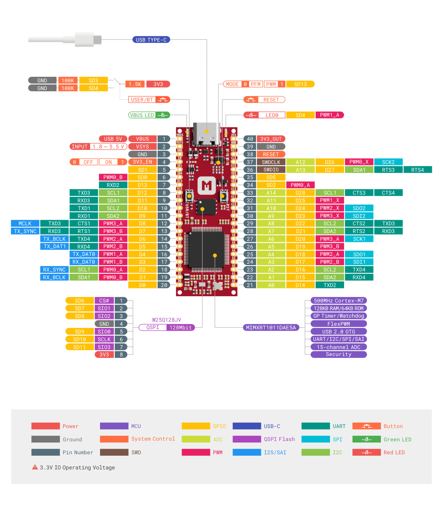
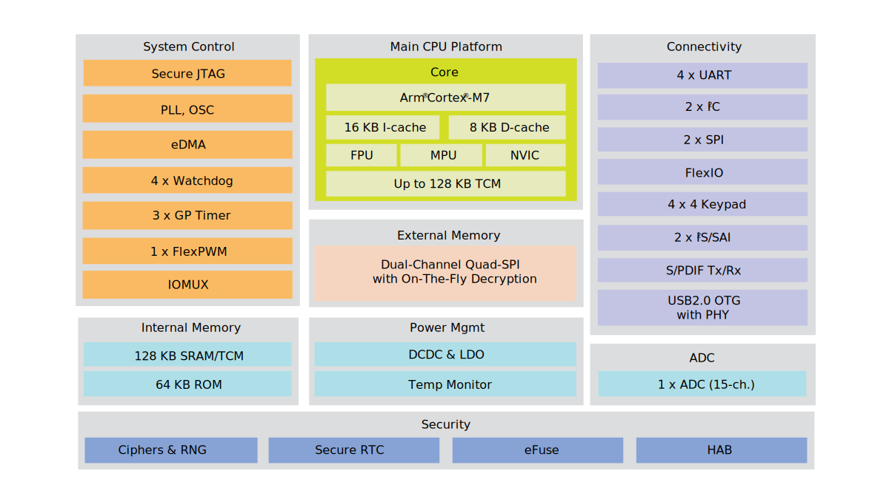

# iMX RT1011 Nano Kit is Here!

## Overview

We are excited to announce the [iMX RT1011 Nano Kit], a small and high-performing prototyping kit designed around NXP's iMX RT1011 Crossover MCU based on the Arm Cortex-M7 core, which operates at speeds up to 500 MHz to provide high CPU performance and best real-time response.

iMX RT1011 Nano Kit comes in the same form factor we first introduced in our [nRF52840 Connect Kit], and provides external 128 Mbit QSPI flash with XIP support, flexible power management, programmable LED and Button, up to 33 multi-function GPIO pins (15 can be configured as ADC inputs) and Serial Wire Debug (SWD) port.

## iMX RT1011 Crossover MCU

The iMX RT1011 is a member of NXP's iMX RT real-time processor family based on the Arm® Cortex®-M7 core, which operates at speeds up to 500 MHz to provide high CPU performance and best real-time response. It has 128 KB on-chip RAM that can be flexibly configured as TCM or general-purpose as well as numerous peripherals including high speed USB, UART, SPI, I2C, SAI, PWM, GPIO, ADC and etc to support a wide range of applications.

## Easy firmware update

iMX RT1011 Nano Kit is shipped with the [UF2 Bootloader](../../../programming/uf2boot.md), which is an easy-to-use and self-upgradable bootloader that can be used to update the firmware by just copying the .uf2-format images to the flash drive.

In addition, you can always enter the ROM Serial Downloader even when the UF2 Bootloader gets corrupted somehow and use the [MCUXpresso Secure Provisioning Tool](../../../programming/mcuxpresso-secure-provisioning.md) to build and write the images to the board.

## Zephyr RTOS support

The Zephyr Project is a Linux Foundation hosted Collaboration Project. It’s an open-source collaborative effort uniting developers and users in building a best-in-class small, scalable real⁃time operating system (RTOS) optimized for resource-constrained devices, across multiple architectures.

Zephyr RTOS support is available on iMX RT1011 Nano Kit. To quickly get started with the Zephyr RTOS application development, refer to our [Develop with Zephyr RTOS](../../../guides/zephyr/index.md) guide.

## CircuitPython support

Python is a high-level programming language which means it's designed to be easier to read, write and maintain. It has a built-in interpreter which means there are no extra steps, like compiling, to get your code to work.

iMX RT1011 Nano Kit can run [CircuitPython](https://circuitpython.org/) which allows you to access hardware-specific functionality and peripherals with Python programming language. With CircuitPython, there are no upfront desktop downloads needed. Once you get your board set up, open any text editor, and start editing code. It's that simple. To get started with CircuitPython, check our [Code in Python](../../../guides/python/index.md) guide.

## Get Involved

Interested in our brand new iMX RT1011 Nano Kit? You can get it from [the official store](https://makerdiary.com/products/imxrt1011-nanokit) or refer to our [wiki page](https://wiki.makerdiary.com/imxrt1011-nanokit) for more technical resources.

[nRF52840 Connect Kit]: https://makerdiary.com/products/nrf52840-connectkit
[iMX RT1011 Nano Kit]: https://makerdiary.com/products/imxrt1011-nanokit
