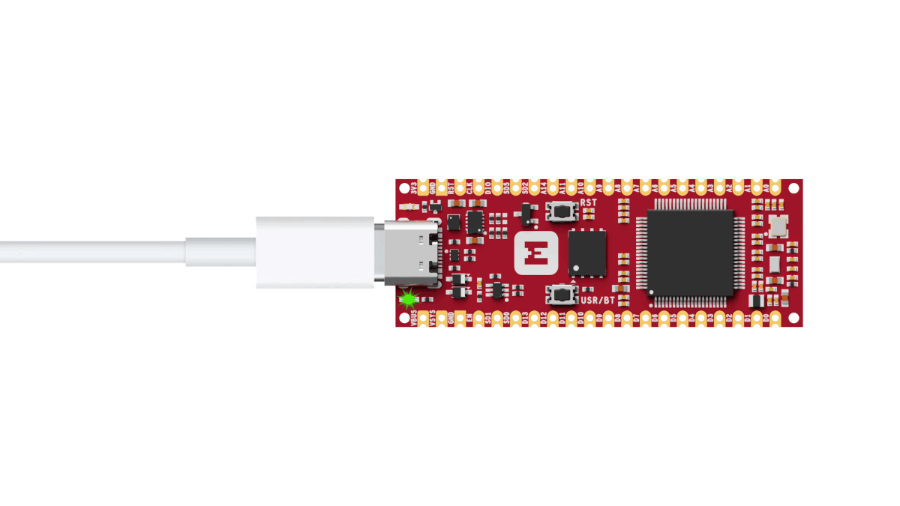

# iMX RT1011 Nano Kit Quick Start Guide

## Introduction

This guide provides a quick introduction to running the Out-of-Box Demo for iMX RT1011 Nano Kit. The Out-of-Box Demo blinks the Red LED forever and prints logs to the console over USB.

## Requirements

Before you start, check that you have the required hardware and software:

* 1x [iMX RT1011 Nano Kit](https://makerdiary.com/products/imxrt1011-nanokit)
* 1x USB-C Cable
* A computer running macOS, Linux, or Windows 7 or newer

## Flashing the Demo (Optional)

iMX RT1011 Nano Kit is shipped with the UF2 Bootloader and led blinky demo. If the firmware is not present, follow the steps below to flash the demo:

1. Connect iMX RT1011 Nano Kit to your computer using the USB-C Cable.
2. Double-click the __RST__ button to enter UF2 Bootloader mode.
3. The board will mount as a Mass Storage Device called __UF2BOOT__ and the Red LED blinks slow.
4. [Download](https://github.com/makerdiary/imxrt1011-nanokit/blob/main/firmware/blinky/blinky.uf2) the demo firmware. Drag and drop `blinky.uf2` onto the __UF2BOOT__ volume.
5. After the firmware is done flashing, the demo will start running. If not, try to click the __RST__ button to reset the board.

!!! Tip "Ensure UF2 Bootloader is present"
    If the UF2 Bootloader is not present or gets corrupted somehow, you can re-install the UF2 Bootloader by following the [UF2 Bootloader Installation](./programming/uf2boot.md#installing-uf2-bootloader) section.

## Running the Demo

Now, you can run the demo by following the steps below:

1. Connect the board to your computer using the USB-C Cable.
2. When the board is powered, the Green LED should stay on and the Red LED should flash on and off.

    

3. Open up a serial terminal, specifying the correct serial port that your computer uses to communicate with the board:

    === "macOS/Linux"

        Open up a terminal and run:

        ``` bash linenums="1"
        screen <serial-port-name> 115200
        ```

    === "Windows"

        1. Start [PuTTY].
        2. Configure the correct serial port and click __Open__:

            

4. Observe the output of the terminal. You should see the output, similar to what is shown in the following:

    ``` { .bash .no-copy linenums="1" }
    *** Booting Zephyr OS build v3.7.0-189-g988e4cf77094 ***
    LED state: OFF
    LED state: ON
    LED state: OFF
    LED state: ON
    LED state: OFF
    LED state: ON
    ...
    ```

## Next steps

Congratulations! You have finished the iMX RT1011 Nano Kit quick start guide. Want to learn more? Check out the following pages:

<div class="grid cards" markdown>

-   __Programming with UF2 Bootloader__

    ---

    Learn how to install UF2 Bootloader on iMX RT1011 Nano Kit and flash the application code in UF2.

    [:octicons-arrow-right-24: Learn more](./programming/uf2boot.md)

-   __MCUXpresso Secure Provisioning Tool__

    ---

    Learn how to use MCUXpresso Secure Provisioning Tool to prepare and flash images.

    [:octicons-arrow-right-24: Learn more](./programming/mcuxpresso-secure-provisioning.md)

-   __Develop with Zephyr RTOS__

    ---

    Learn how to get started with Zephyr RTOS on iMX RT1011 Nano Kit and explore some of the typical samples.

    [:octicons-arrow-right-24: Getting started](./guides/zephyr/index.md)

-   __Code in Python__

    ---

    Get started with CircuitPython on iMX RT1011 Nano Kit and explore some of the typical samples in Python.

    [:octicons-arrow-right-24: Getting started](./guides/python/index.md)

</div>


[PuTTY]: https://apps.microsoft.com/store/detail/putty/XPFNZKSKLBP7RJ
