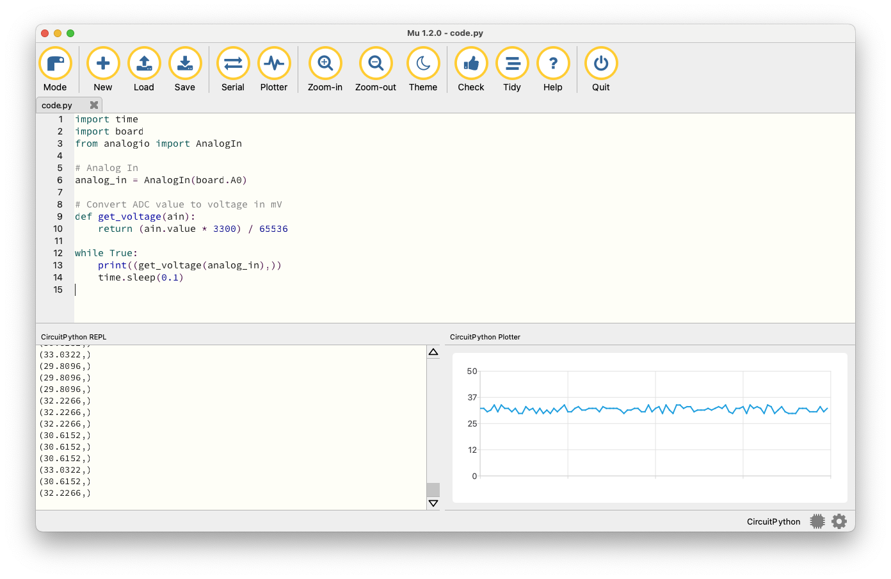

# ADC

The ADC sample demonstrates using the `analogio` module to measure the voltage of the __A0__ pin.

## Requirements

Before you start, check that you have the required hardware and software:

- 1x [iMX RT1011 Nano Kit](https://makerdiary.com/products/imxrt1011-nanokit) running the [CircuitPython] firmware
- 1x USB-C Cable
- [Mu Editor]
- A computer running macOS, Linux, or Windows 7 or newer

## Running the code

To run the code, complete the following steps:

1. Connect iMX RT1011 Nano Kit to your computer using the USB-C Cable.
2. Start Mu Editor, click __Load__ to open `code.py` in the __CIRCUITPY__ drive.
3. Copy and paste the following code into `code.py` and click __Save__:


    ``` python linenums="1" title="CIRCUITPY/code.py"

	import time
	import board
	from analogio import AnalogIn

	# Analog In 
	analog_in = AnalogIn(board.A0)

	# Convert ADC value to voltage in mV
	def get_voltage(ain):
		return (ain.value * 3300) / 65536

	while True:
		print((get_voltage(analog_in),))
		time.sleep(0.1)

    ```

4. Your code will run as soon as the file is done saving. Click __Serial__ on Mu Editor's Top Menu to open a serial console. You should see the console output, similar to what is shown in the following:

    ``` { .bash .no-copy linenums="1"}
    Code stopped by auto-reload. Reloading soon.

    Auto-reload is on. Simply save files over USB to run them or enter REPL to disable.
    code.py output:
	(30.6152,)
	(32.2266,)
	(33.0322,)
	(32.2266,)
	(31.4209,)
	(30.6152,)
	(29.8096,)
	(31.4209,)
	(32.2266,)
	(33.0322,)
    ...
    ```

5. You can also use the plotter for data inspection. Click __Plotter__ on Mu Editor's Top Menu to open up a plotter pane:

    


[Mu Editor]: ../getting-started.md#coding-with-mu-editor
[CircuitPython]: ../getting-started.md#installing-circuitpython
