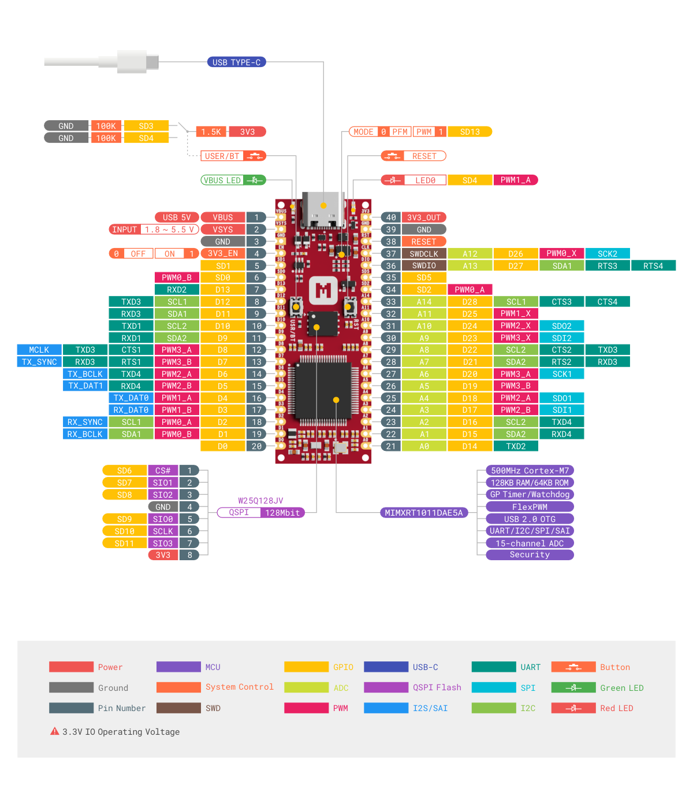

# Hardware description

This section of the documentation specifies and describes the iMX RT1011 Nano Kit mainly from a hardware point of view.

## Hardware diagram

The following figure illustrates the iMX RT1011 Nano Kit hardware diagram. The design is available with loose or pre-soldered pin headers.

## Mechanical dimensions

iMX RT1011 Nano Kit is a single sided 55.88mm x 20.32mm (2.2" x 0.8") 1mm thick PCB with a USB Type-C port and dual castellated/through-hole pins.

## Power supply

iMX RT1011 Nano Kit can be powered by either the USB-C port or alternatively __VSYS__ pin with wide input voltage range (1.8-5.5V). An on-board buck-boost converter ([TPS63802]) provides 3V3 to the MIMXRT1011 MCU and all other peripherals.

The following figure illustrates the power supply circuitry:

__VBUS__ is the __5V__ input from the USB-C port. There are two parallel Schottky diodes between __VBUS__ and __VSYS__, which add flexibility by allowing power ORing of different supplies into __VSYS__.

Set __3V3_EN__ __`HIGH`__ to enable __3V3__ output and __`LOW`__ to disable __3V3__ output. This pin has a pull-up resistor (100KOhm) and can be tied to __GND__ to place the board in Power-Down mode.

Set __MODE__ __`LOW`__ for power save mode and __`HIGH`__ for forced PWM mode. This pin is tied to __`GPIO_SD_13`__ with a pull-down resistor (100KOhm).

!!! example "How to power the board?"

    iMX RT1011 Nano Kit has simple and flexible power management with various options for easily powering the board from USB-C, external supplies or batteries.

    === "Using USB-C port"

        This is the simplest way to power the board, which will power __VSYS__ (and therefore the system) from the 5V USB __VBUS__ voltage, through two internal Schottky diodes (so __VSYS__ becomes __VBUS__ minus the Schottky diode forward voltage).

        

    === "Feeding VSYS directly"

        If the USB-C port is __NOT__ going to be used, it is safe to power the board by directly connecting __VSYS__ to your preferred power source (in the range 1.8V to 5.5V).

        

    === "Feeding VSYS via a Schottky diode"

        To safely add a second power source to the board, simply feed __VSYS__ through an external Schottky diode.

        

    === "Feeding VSYS via a P-MOSFET"

        An improved way to power from a second source is using an external P-MOSFET to replace the Schottky diode as shown in the following figure.

        

    === "Using a battery charger"

        iMX RT1011 Nano Kit can be also used with a battery charger with power path manager which will automatically and seamlessly switch between the input source and the battery power.

        

## General purpose I/Os

iMX RT1011 Nano Kit has up to 33 multi-function General Purpose I/Os (`A0`~`A14` can be used as ADC inputs) available on the header pins. These GPIOs are powered from the on-board 3.3V rail, and should be used for 3.3V logic level.

The following figure illustrates the GPIOs pinout:

## Buttons and LEDs

iMX RT1011 Nano Kit has two buttons - __RST__ button and __USR/BT__ button:

* __RST__ button: Used to reset the iMXRT1011 MCU.
* __USR/BT__ button: Used for user input or Boot Mode trigger.

The Green LED is used for USB power indicating and the Red LED is controlled by __`GPIO_SD_4`__.

The following table shows the Buttons and LEDs connections:

| Part              | GPIO              | Description            |
|-------------------|-------------------|------------------------|
| RST Button        | __`NC`__          | Press to reset the MCU |
| USR/BT Button     | __`GPIO_SD_3`__   | Hold while powering up to enter Serial Downloader on ROM.  Pull __`GPIO_SD_3`__ LOW when pressed at normal mode |
| Green LED         | __`NC`__          | Indicate USB power     |
| Red LED           | __`GPIO_SD_4`__   | Set __`GPIO_SD_4`__ HIGH/LOW to turn on/off the LED |

## External memory

iMX RT1011 Nano Kit has 128 Mbit QSPI Flash ([W25Q128JV]) with XIP support and on-the-fly decryption for firmware and disk storage. The memory is connected to the MIMXRT1011 MCU using FlexSPI:

| FlexSPI           | W25Q128JV Pin    |
|-------------------|------------------|
| __`GPIO_SD_6`__   | __`CS#`__        |
| __`GPIO_SD_10`__  | __`SCLK`__       |
| __`GPIO_SD_9`__   | __`SIO0/SI`__    |
| __`GPIO_SD_7`__   | __`SIO1/SO`__    |
| __`GPIO_SD_8`__   | __`SIO2/WP#`__   |
| __`GPIO_SD_11`__  | __`SIO3/HOLD#`__ |

## Boot mode configurations

iMX RT1011 Nano Kit has two boot modes. The boot mode is selected based on the binary value stored in the internal __BOOT_MODE__ register. __USR/BT__ button is used to select the boot mode on the iMX RT1011 Nano Kit.

The following table shows the Boot Mode Configurations:

| MODE              | USR/BT Button             | BOOT_MODE[1:0] |
|-------------------|---------------------------|----------------|
| Internal Boot     | Released                  | `0b10`         |
| Serial Downloader | Pressed while powering up | `0b01`         |

## Debug interface

iMX RT1011 Nano Kit supports Arm Serial Wire Debug (SWD) port, which makes it possible to connect external debuggers for debugging and programming. The I/O voltage of SWD should be 3.3V.

The following figure demonstrates how to connect an external debugger (for example, [Pitaya-Link debug probe]) for debugging:

The connections are listed in the table below:

| Debugger     | Wire                                                      | iMX RT1011 Nano Kit |
|:------------:|:---------------------------------------------------------:|:-------------------:|
| __`3V3`__    | :fontawesome-solid-arrow-right-long:{ .red-wire }         | __`VSYS`__          |
| __`GND`__    | :fontawesome-solid-arrow-right-long:{ .gray-wire }        | __`GND`__           |
| __`RESET`__  | :fontawesome-solid-arrow-right-long:{ .amber-wire }       | __`RESET`__         |
| __`SWDCLK`__ | :fontawesome-solid-arrow-right-long:{ .light-green-wire } | __`SWDCLK`__        |
| __`SWDIO`__  | :fontawesome-solid-arrows-left-right:{ .light-blue-wire } | __`SWDIO`__         |

[Pitaya-Link debug probe]: https://makerdiary.com/products/pitaya-link
[TPS63802]: https://www.ti.com/product/TPS63802
[W25Q128JV]: https://www.winbond.com/hq/product/code-storage-flash-memory/serial-nor-flash/index.html?__locale=en&partNo=W25Q128JV
