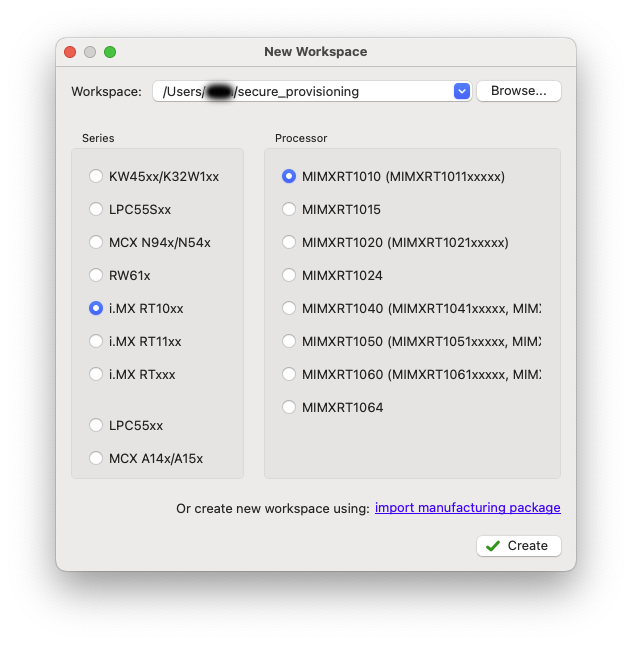
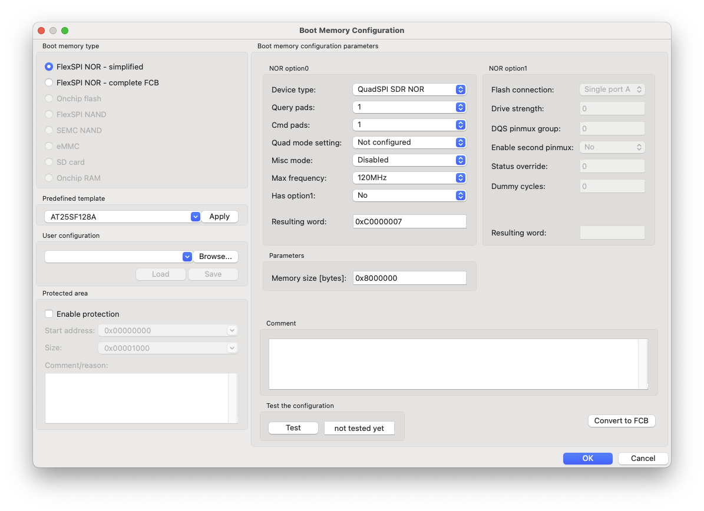
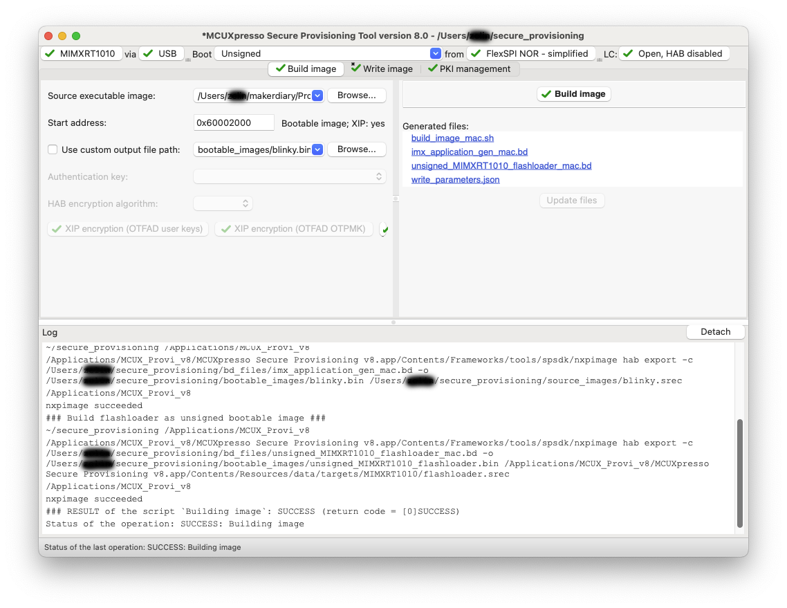
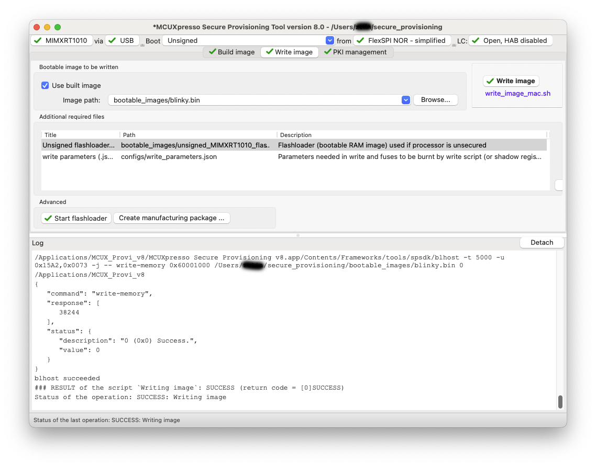

# MCUXpresso Secure Provisioning Tool

The MCUXpresso Secure Provisioning Tool is a GUI-based application provided to simplify generation and provisioning of bootable executables on NXP MCU devices.

This section show you how to program iMX RT1011 Nano Kit using MCUXpresso Secure Provisioning Tool.

For more details about MCUXpresso Secure Provisioning Tool, please refer to the [MCUXpresso Secure Provisioning Tool User Guide](../assets/attachments/MCUXSPTUG.pdf).

{ width='100%' }

## Installation

The MCUXpresso Secure Provisioning Tool runs on the macOS, Linux, and Windows operating systems. Visit the NXP website (https://www.nxp.com/mcuxpresso/secure) to download the MCUXpresso Secure Provisioning Tool for your operating system. Here we use the version `V8.0`.

Start the installer and follow the wizard to finish the installation.

## Generating bootable image

Before writing image into the external flash memory of iMX RT1011 Nano Kit, you need to convert the prepared application into a bootable image.

Here, we take for example the [blinky.hex], showing how to generate it into a bootable image.

1. Start MCUXpresso Secure Provisioning Tool, then select the __`MIMXRT1010 (MIMXRT1011xxxxx)`__ processor in the __New Workspace__ window and click __Create__.

	

2. Make sure that Boot Type is *Unsigned*.

3. Config the Boot Memory:

	1. Set __Boot memory type__ to _FlexSPI NOR - simplified_
	2. Apply __Predefined template__ _AT25SF128A_
	3. Click __OK__ to finish __Boot Memory Configuration__

	

4. Switch to the __Build image__ tab.
5. Select the __Source executable image__ that is, for example, the [blinky.hex].
6. Click __Build Image__ button to generate the bootable image.

[blinky.hex]: https://github.com/makerdiary/imxrt1011-nanokit/blob/main/firmware/blinky/blinky.hex

## Writing the bootable image

Now, you can write the image that was generated above into the external flash memory of iMX RT1011 Nano Kit:

1. Switch to the __Write image__ tab.
2. Make sure that the __Use built image__ option is selected.
3. Push and hold the __USR/BT__ button and plug your board into the USB port of your computer.
4. The board will run into Boot ROM Serial Download mode.
5. Click __Write Image__ button to start programming.
6. When finished, press the __RST__ button on the board. The image will start running.

!!! Warning
	The MCUXpresso Secure Provisioning Tool will overwrite the flash memory area of UF2 Bootloader after performing writing image. You can follow the [UF2 Bootloader Installation](./uf2boot.md#installing-uf2-bootloader) section to re-install the UF2 Bootloader if needed.