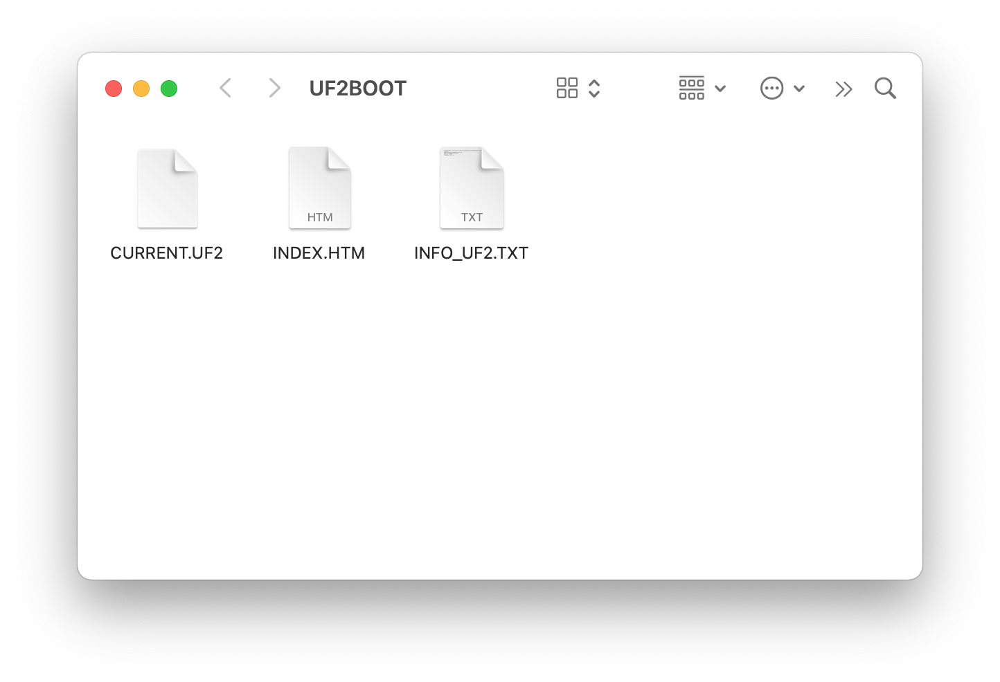
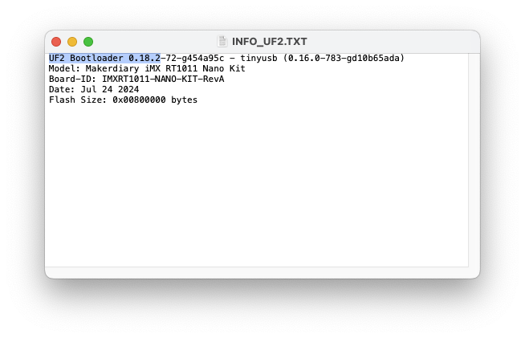

# Update firmware using the UF2 Bootloader

## Overview

iMX RT1011 Nano Kit is shipped with the UF2 Bootloader, which is an easy-to-use and self-upgradable bootloader that can be used to update the firmware by just copying the `.uf2`-format images to the flash drive without using an external programmer.

UF2 Bootloader runs entirely on SRAM which is not only super fast but also easy to perform self-update. After powering on, if UF2 Bootloader already exists on external flash, it will be loaded to internal SRAM and start executing from there.

This section details how to update firmware using the UF2 Bootloader.

## External flash memory layout

When updating firmware using the UF2 Bootloader, you must be aware of where in the external flash memory the bootloader and the application firmware are located.

The following figure shows the default external flash memory layout of iMX RT1011 Nano Kit:

| Usage                    | Memory location | Size   |
|--------------------------|-----------------|--------|
| Flash Config             | 0x60000400      | 0x00000C00 (3 KB)  |
| Image Vector Table (IVT) | 0x60001000      | 0x00001000 (4 KB)  |
| Interrupts               | 0x60002000      | 0x00000400 (1 KB)  |
| Bootloader               | 0x60002400      | 0x0000A000 (40 KB) |
| Application              | 0x6000C000      | 16 MB - 48 KB      |

!!! Note
	The application firmware must start from `0x6000C000` when the UF2 Bootloader is present, so that the bootloader can find the application and boot it.

## Installing UF2 Bootloader

The i.MX RT has built-in bootloader in ROM that implements the NXP Serial Download Protocol (SDP), which can be used to load & execute UF2 Bootloader to SRAM with `spdhost` tool via USB.

To install the UF2 Bootloader, complete the following steps:

1. Follow the [SPSDK Installation Guide] to install NXP SPSDK.

2. Verify the `spdhost` tool by running the following command:

	``` { .bash linenums="1" }
	spdhost --version
	```

3. Push and hold the __USR/BT__ button and plug your board into the USB port of your computer.
4. A new USB device named __`SE Blank RT Family`__ will be detected by your computer.
5. Download the lastest UF2 Bootloader firmware. The bootloader is located in [firmware/uf2_bootloader] with the name `uf2_bootloader-imxrt1011_nanokit-<version>.bin`.
6. Open up a terminal window and run two commands with `sdphost`, changing the name of the `.bin` file as appropriate:

	``` { .bash linenums="1" }
	sdphost -u 0x1fc9,0x0145 write-file 0x20206400 uf2_bootloader_imxrt1011_nanokit_<version>.bin
	```
	``` { .bash linenums="2" }
	sdphost -u 0x1fc9,0x0145 jump-address 0x20207000
	```

7. Re-plug the board or press the __RST__ button, the UF2 bootloader will start running and the board will mount as a Mass Storage Device called __UF2BOOT__.

	

[SPSDK Installation Guide]: https://spsdk.readthedocs.io/en/latest/usage/installation.html

## Updating the UF2 Bootloader

The UF2 Bootloader is self-upgradable, and you can simply drag & drop an update file in `.uf2` format into __UF2BOOT__ to update. This way is quite easy and highly recommended when updating the UF2 Bootloader to newer version.

To update the bootloader, complete the following steps:

1. Plug your board into the USB port of your computer.
2. Double-click the __RST__ button to enter UF2 Bootloader mode.
3. The board will mount as a Mass Storage Device called __UF2BOOT__ and the Red LED blinks slow.
4. Open `INFO_UF2.TXT` in the __UF2BOOT__ volume with a text editor, and check the current version of bootloader. The figure below shows we are running the `0.18.2` version.
	

5. Check if newer updates are available in the [firmware/uf2_bootloader] folder. The update file is released with the name `update-uf2_bootloader-imxrt1011_nanokit-<version>.uf2`.
6. Drag and drop the update file into the __UF2BOOT__ volume.
7. Re-plug the board and enter UF2 Bootloader mode again, then verify the version printed in `INFO_UF2.TXT`.

[firmware/uf2_bootloader]: https://github.com/makerdiary/imxrt1011-nanokit/tree/main/firmware/uf2_bootloader

## Flashing application firmware

It is quite easy to flash the application firmware, just simply dragging & dropping any compatible UF2 file onto the __UF2BOOT__ volume.

!!! Warning
	Before flashing the UF2, you should make sure the firmware starts from the correct flash memory address __`0x6000C000`__.

To flash your application firmware, just follow the steps below:

1. Plug your board into the USB port of your computer.
2. Double-click the __RST__ button to enter UF2 Bootloader mode.
3. The board will mount as a Mass Storage Device called __UF2BOOT__ and the Red LED blinks slow.
4. Drag and drop the UF2 file onto the __UF2BOOT__ volume. The RGB LED blinks red fast during flashing.
5. Re-plug or click __RST__ button to reset the board, then the new application firmware will start running.

## Generating UF2 file from `.hex` or `.bin`

Before flashing the `.hex` or `.bin` firmware, you need to generate them to `.uf2` format. The following steps show you how to generate UF2 file from `.hex` or `.bin` file:

1. Make sure that you have Python 3.6.0 or later installed.
2. Install UF2 Converter. Open up a terminal and run the following command to install the latest prerelease version from the HEAD of the main branch:

	=== "Windows"

		``` bash linenums="1"
		py -3 -m pip install --pre -U git+https://github.com/makerdiary/uf2utils.git@main
		```

	=== "Linux/macOS"

		``` bash linenums="1"
		python3 -m pip install --pre -U git+https://github.com/makerdiary/uf2utils.git@main
		```

3. Verify the `uf2conv` tool by running the following command:

	``` { .bash linenums="1" }
	uf2conv --help
	```

4. To generate UF2 file, simply use `uf2conv` on a `.hex` or `.bin` file, specifying the family as `0x4fb2d5bd`:

	=== "Generating from `.hex`"

		``` bash linenums="1"
		uf2conv -f 0x4fb2d5bd -c -o application.uf2 application.hex
		```

	=== "Generating from `.bin`"

		``` bash linenums="1"
		uf2conv -f 0x4fb2d5bd -c -b 0x6000C000 -o application.uf2 application.bin
    	```
